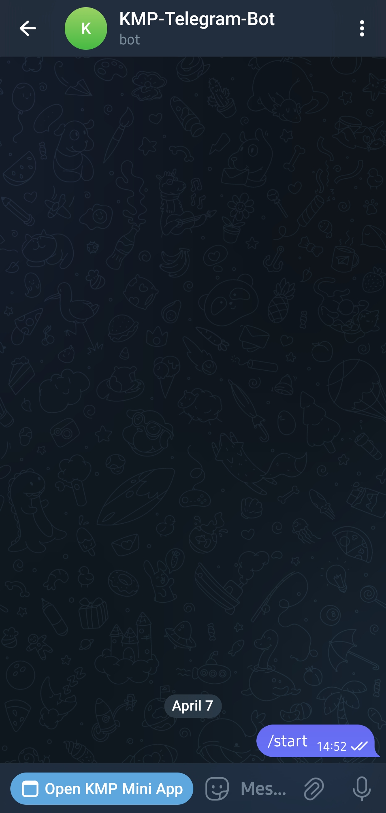
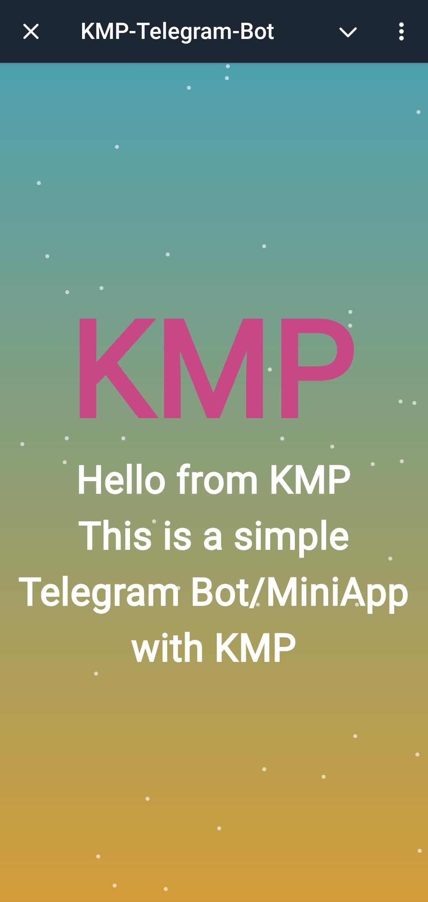

# Telegram Bot & Mini App with Kotlin Multiplatform (KMP)

[](https://kotlinlang.org/)
[](https://gradle.org/)
[](https://ktor.io/)
[](https://kotlinlang.org/docs/wasm-overview.html)

This is a simple Telegram Bot and Mini App project built using Kotlin Multiplatform (KMP). It demonstrates how to create a cross-platform application where the client-side Mini App runs in Telegram using WebAssembly (WASM) and the backend logic is handled by a Ktor server.

## Screenshots
<br />
<div align="center">
  <a href="https://github.com/othneildrew/Best-README-Template">
    
  </a>
    <a href="https://github.com/othneildrew/Best-README-Template">
    
  </a>
</div>

## Features

* **Cross-Platform:** Built with Kotlin Multiplatform, allowing code sharing between the client (WASM) and server (JVM).
* **Telegram Bot Integration:** A simple Telegram bot that can interact with users.
* **Telegram Mini App:** A web-based application running within Telegram, built with Kotlin/WASM.
* **Ktor Backend:** Uses the Ktor framework for handling server-side logic and potentially API endpoints for the Mini App.

## Tech Stack

* **Kotlin Multiplatform (KMP):** The foundation for building cross-platform applications.
* **Kotlin:** The primary programming language.
* **Telegram Bot API:** Used to interact with the Telegram Bot platform.
* **WebAssembly (WASM):** Enables the client-side Mini App to run in Telegram.
* **Ktor:** A powerful and lightweight asynchronous framework for creating the backend server.
* **Gradle:** The build automation system.

## How to run
* Create a new telegram bot using [Telegram Bot Father](https://telegram.me/BotFather). give it a name and copy the token.
* Use [ngrok](https://dashboard.ngrok.com/get-started/setup/macos) to create an https domain for the web app locally.

## Project Structure

The project follows a multi-module structure:
```
telegram-mini-app/
├── client/
│   └── composeApp/         # Contains the Compose for Web Mini App (WASM target)
├── gradle/
├── server/
│   └── server/             # Contains the Ktor backend server (JVM target)
├── .gitignore
├── build.gradle.kts
├── gradlew
├── gradlew.bat
├── local.properties
└── settings.gradle.kts
```
